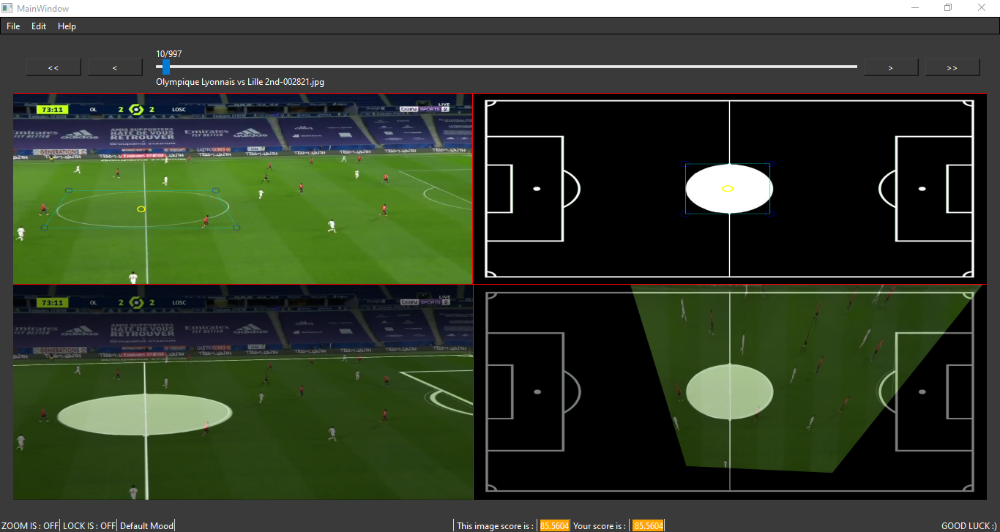
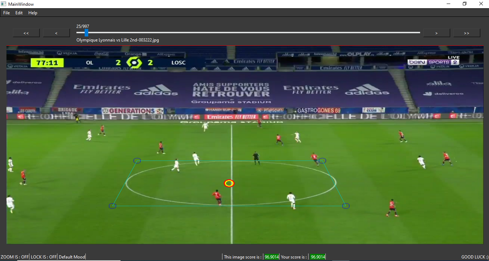
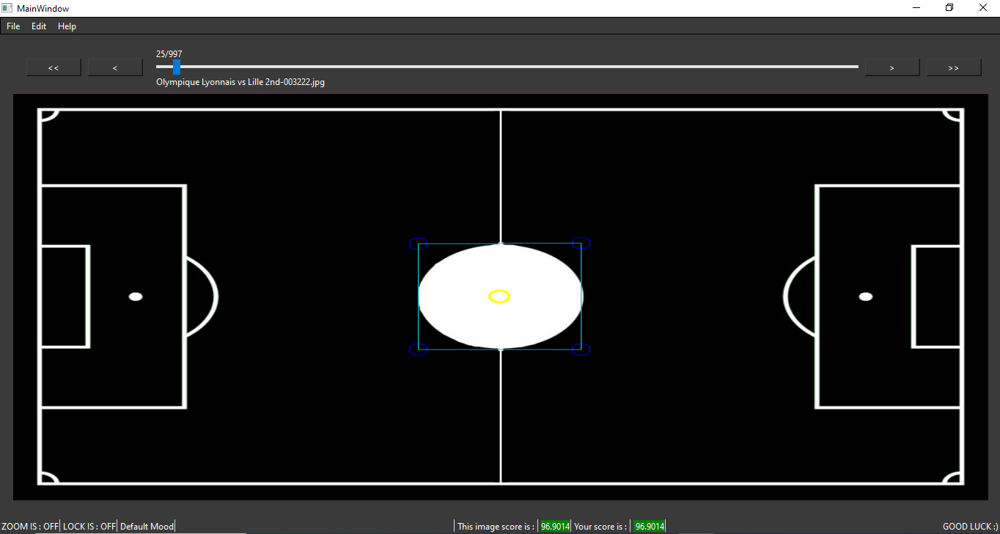
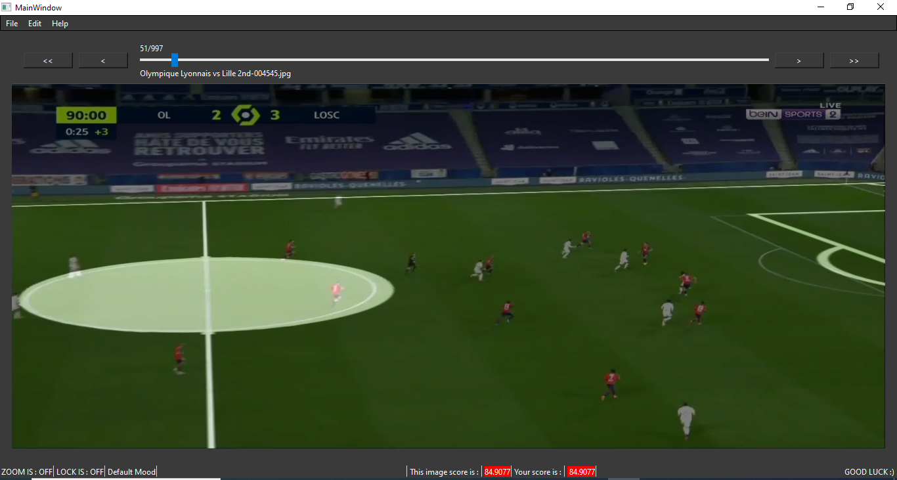
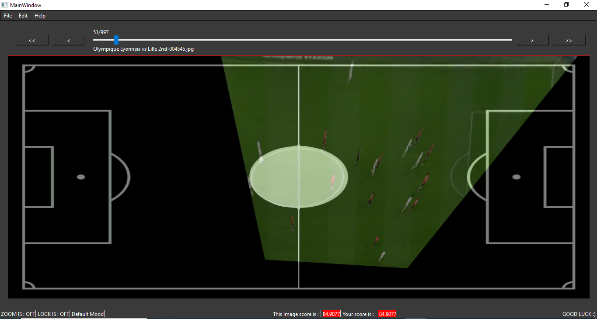

# Football-Match-Camera-Position-Estimation-Tool

## Overview
This project is a Qt-based application for football analysis and data annotation in a 2D view. It provides tools for calculating scores based on image transformations and manipulations. The application utilizes OpenCV for image processing and Qt for the graphical user interface.


   
 


## Features
- **Image Loading and Display**: Supports loading and viewing images within the application.
- **Perspective Transformations**: Applies various image transformations for accurate data representation.
- **Score Calculation**: Implements scoring functions based on image analysis.
- **Interactive UI**: Provides dialogs for parameter editing, shortcut management, and configuration settings.
- **Configuration Management**: Saves and loads settings related to image processing.
- **Customizable Themes**: Supports styling via Qt stylesheet files.

## Technologies Used
- **Programming Languages**: C++, Qt Framework
- **Libraries**: OpenCV (for image processing), Qt (for UI and event handling)
- **Build System**: CMake

## Directory Structure
```
.
├── CMakeLists.txt                 # Main CMake configuration file
├── src/
│   ├── main.cpp                   # Entry point of the application
│   ├── mainwindow.cpp              # Main window implementation
│   ├── mainwindow.h
│   ├── mainwindow.ui               # UI layout file
│   ├── playGround.cpp              # Playground module
│   ├── playGround.h
│   ├── playGround.ui
│   ├── predToReal.cpp              # Prediction to real transformation module
│   ├── predToReal.h
│   ├── predToReal.ui
│   ├── realToPred.cpp              # Real to predicted transformation module
│   ├── realToPred.h
│   ├── realToPred.ui
│   ├── real.cpp                    # Real-world coordinate handling
│   ├── real.h
│   ├── real.ui
│   ├── edit.cpp                    # Edit dialog implementation
│   ├── edit.h
│   ├── edit.ui
│   ├── shortcutsdialog.cpp         # Shortcuts management
│   ├── shortcutsdialog.h
│   ├── shortcutsdialog.ui
│   ├── events.h                    # Event handling
│   ├── systemState.h               # Application state management
│   ├── ImageState.h                # Image state management
│   ├── calcPointsPositions.h       # Point calculations for image annotation
│   ├── score.h                     # Score computation logic
│   ├── matrix.h                    # Perspective transformations
│   ├── draw.h                      # Drawing functions
│   ├── txtOperations.h             # File operations (saving/loading data)
│   ├── gui.h                       # UI setup functions
│   ├── theme.qss                   # UI styling file
│   ├── ratios.config               # Configuration for aspect ratios
│   ├── img.qrc                      # Qt resource file for images
```

## File Descriptions
- **calcPointsPositions.h**: Handles calculations for point positioning in images.
- **CMakeLists.txt**: Configures the build system, linking Qt and OpenCV.
- **draw.h**: Provides functions for drawing shapes and perspectives on images.
- **edit.cpp/h/ui**: Implements the edit dialog for modifying image parameters.
- **events.h**: Manages key presses, mouse events, and other interactions.
- **gui.h**: Contains UI setup functions and stylesheet handling.
- **horizontalSlider.h**: Manages horizontal slider movements.
- **ImageState.h**: Stores information about the current state of images.
- **main.cpp**: The entry point of the application.
- **mainwindow.cpp/h/ui**: Implements the main application window.
- **matrix.h**: Contains functions for perspective transformations.
- **playGround.cpp/h/ui**: Implements the playground module for image manipulation.
- **predToReal.cpp/h/ui**: Handles predicted-to-real coordinate transformations.
- **realToPred.cpp/h/ui**: Handles real-to-predicted coordinate transformations.
- **score.h**: Implements scoring algorithms based on image analysis.
- **shortcutsdialog.cpp/h/ui**: Provides a dialog for managing keyboard shortcuts.
- **systemState.h**: Stores the overall state of the application.
- **theme.qss**: Defines the visual appearance of the UI.
- **txtOperations.h**: Contains functions for saving/loading configuration and image data.

## Installation & Setup
### Prerequisites
- **Qt Framework** (Qt 5 or later recommended)
- **OpenCV** (for image processing capabilities)
- **CMake** (for project configuration and building)

### Steps to Build and Run
1. Clone the repository:
   ```bash
   git clone https://github.com/your-repo/football-analysis.git
   cd football-analysis
   ```
2. Create a build directory:
   ```bash
   mkdir build && cd build
   ```
3. Run CMake to configure the project:
   ```bash
   cmake ..
   ```
4. Compile the application:
   ```bash
   make
   ```
5. Run the application:
   ```bash
   ./football_analysis
   ```

## Usage
1. **Load an Image**: Open an image file for analysis.
2. **Apply Transformations**: Use the UI tools to manipulate the image.
3. **Calculate Scores**: Perform score calculations based on image modifications.
4. **Save & Export Data**: Store analysis results for later use.

## Contribution Guidelines
We welcome contributions! To contribute:
1. Fork the repository.
2. Create a feature branch: `git checkout -b feature-name`
3. Commit changes: `git commit -m "Add new feature"`
4. Push to the branch: `git push origin feature-name`
5. Open a pull request.

## License
This project is licensed under the [MIT License](LICENSE).
